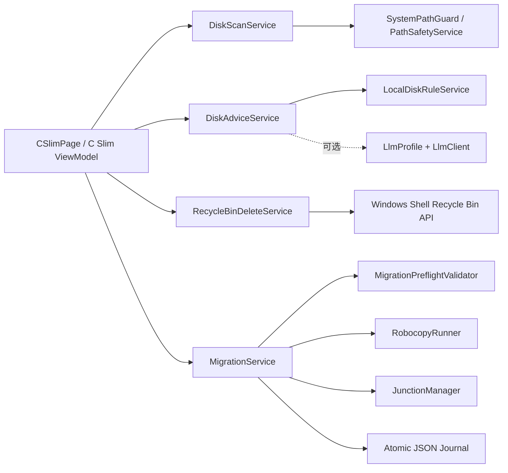

# C 盘瘦身商业交付版技术设计

## 1. 设计目标

本设计基于已确认的 `requirements.md`，在现有 WPF + CommunityToolkit.Mvvm + .NET 8 Windows 架构上增量改造 C 盘瘦身模块。核心目标是：本地规则可独立运行、所有危险操作由服务层硬保护、迁移具备校验和可回退能力、UI 全程异步且可解释。

## 2. 总体架构

不新增第三方清理或提权依赖。现有 `Locator` 继续负责服务组合；服务方法不依赖 ViewModel 的筛选结果来保证安全。

## 3. 数据模型

### 3.1 扫描模型

扩展 `DiskScan.cs`：

- `DiskCandidate`：路径、分类、默认动作、风险等级、来源。
- `FolderSizeInfo`：大小、文件数、目录数、最近修改时间、是否部分跳过、跳过原因数量。
- `DiskScanSummary`：根目录、总容量、已用、可用、占用率、扫描时间。
- `DiskScanProgress`：阶段、当前路径、已完成数、总数、百分比、可取消状态。
- `DiskScanResult`：候选结果、摘要、跳过明细、是否取消。

所有大小使用 `long`，UI 显示通过统一格式化方法处理，避免溢出和文化区域差异。

### 3.2 建议和操作结果模型

- `DiskAdvice` 保留现有接口并增加来源标识（`LocalRules` / `Llm` / `LocalFallback`）。
- `DiskCleanableItem` 增加 `Risk`, `Category`, `IsExecutable`，服务层生成时默认只允许明确的缓存/临时项。
- `DiskMigratableItem` 增加 `Risk`, `TargetDrive`, `Reason`；用户文档、下载、桌面等目录默认只提供“建议”，不自动执行。
- 新增 `DiskOperationItemResult`：路径、状态（成功/跳过/失败）、释放或迁移大小、错误码、用户可读说明。
- 新增 `DiskOperationReport`：开始/结束时间、成功/跳过/失败数量、汇总字节数和逐项明细。

### 3.3 迁移日志和恢复状态

扩展 `MigrationLogEntry`，兼容读取旧字段：

- `OperationId`、`Time`、`Source`、`Target`、`Junction`、`State`、`SourceBytes`、`SourceFileCount`、`TargetBytes`、`TargetFileCount`、`Error`。
- `State` 至少包括 `Copying`、`Copied`、`Linked`、`Completed`、`Reverting`、`Reverted`、`Failed`。
- 日志采用版本化 JSON，写入使用现有 `AtomicFile`；旧日志缺失字段时按安全默认值处理。
- 启动时发现未完成记录，只提示用户恢复/清理，不自动删除源或目标数据。

## 4. 路径安全策略

新增或集中封装 `PathSafetyService`，所有路径先规范化为完整路径并使用大小写不敏感的路径边界比较。

### 4.1 永久保护路径

以下路径永不进入默认清理或迁移执行列表：

- Windows 目录、系统目录、WinSxS、Installer、System Volume Information。
- `Program Files`、`Program Files (x86)`、`ProgramData` 根及其应用安装目录。
- 用户 `AppData` 根、NTUSER 配置文件、用户配置关键目录。
- 当前应用安装目录和当前应用数据目录。
- 任意 reparse point / junction / symbolic link 根路径。
- 驱动器根目录、用户目录本身、系统保留目录。

### 4.2 默认安全候选

默认只扫描并允许清理：当前用户临时目录、浏览器缓存目录、Windows 用户级临时缓存、可识别的转储/日志缓存（不包含活动应用配置）。回收站仅显示统计，不将 `$Recycle.Bin` 当普通目录递归删除。

默认迁移候选只允许可识别的用户数据目录，并要求用户逐项确认；`AppData`、运行中应用目录、含 reparse point 的目录、系统/安装目录一律排除。

### 4.3 执行前硬检查

清理和迁移服务在实际执行前重新检查：路径仍存在、路径属于允许分类、没有 reparse point、不是保护路径、不是当前应用目录、目标路径没有越界。UI、LLM 或缓存的旧扫描结果不能绕过该检查。

## 5. 扫描设计

`DiskCandidateProvider` 负责发现候选，不做深度测量；返回去重后的安全候选并附带跳过原因。

`DiskScanService`：

- 提供 `ScanAsync(IEnumerable<DiskCandidate>, IProgress<DiskScanProgress>?, CancellationToken)`。
- 以串行或受控并发测量，避免同时大量 IO 导致 UI 卡顿。
- 遍历时跳过 reparse point；单文件、单目录失败记录 `ScanIssue` 并继续。
- 在每个目录、文件批次和候选之间检查取消令牌。
- 使用 `DriveInfo` 获取 C 盘空间；刷新失败保留上次成功摘要。
- 取消时返回已完成的结果和 `IsCanceled=true`，而不是把取消当成异常错误。
- 通过 `IProgress` 回到 UI 线程更新阶段、路径和进度，不在服务里触碰 WPF 控件。

## 6. 本地规则与 LLM 降级

新增 `LocalDiskRuleService`：

- 按分类、路径安全等级、大小、文件数量、最近写入时间、是否为系统/运行中目录生成解释。
- 临时目录和浏览器缓存默认产生“可清理”建议；用户文件目录只产生“可迁移”建议，风险为需确认。
- 低于最小收益阈值的项目不建议执行。
- 规则输出先经过 `PathSafetyService`，再交给 UI。

`DiskAdviceService` 先运行本地规则，再按以下条件尝试 LLM：存在已激活档案、网络客户端可用、用户主动点击“AI 分析”。LLM 仅用于解释和排序，不决定路径是否安全。超时、网络错误、非法 JSON、无档案均返回本地规则结果，并设置明确的降级状态。发送内容仅包含分类、大小、文件数、匿名化路径末段，不发送文件内容、API Key 或完整隐私路径。

## 7. 清理设计

`RecycleBinDeleteService`：

- 只接受执行前重新验证通过的目录/文件。
- 使用 Windows Shell Recycle Bin API，失败时返回逐项错误；不使用 `Directory.Delete` 作为降级方案。
- 处理目录消失、占用、权限不足、回收站不可用等情况。
- 批量操作逐项执行，形成 `DiskOperationReport`，不能用成功数量掩盖失败项。
- 默认不清理用户文档、桌面、下载和活动应用目录。
- 清理前 UI 显示数量、预计释放量、进入回收站提示和恢复方式。

## 8. 迁移设计

`MigrationService` 使用事务式状态机，严格遵循：

1. 规范化并检查源目录和目标盘。
2. 拒绝同盘、目标在源目录内、无写权限、目标盘不存在、空间不足、保护路径或 reparse point。
3. 检查已知活动进程/占用；无法确认时以风险状态阻止自动执行并提示用户关闭程序。
4. 创建目标临时目录（带 `OperationId`），使用 `robocopy /E /COPY:DAT /DCOPY:DAT /XJ /R:1 /W:1` 复制。
5. 复制完成后用递归文件数、总字节数和关键文件存在性校验；不一致则保留源，删除/标记不完整目标，返回失败。
6. 写入 `Copied` 日志后创建 junction；创建失败时不删除源，保留目标副本并给出回退/清理入口。
7. 确认源路径通过 junction 可访问且能读取校验文件，才将状态标记 `Completed`。
8. 只有确认 junction 生效后，才清理目标临时目录并更新日志；任何异常都保留至少一个完整副本。

回退流程：校验日志和路径仍安全，删除 junction 本身（不递归目标），将目标复制回原路径并重新校验，确认原路径可访问后才删除迁移副本；任何一步失败都不删除唯一副本。目标盘拔出、UAC 取消、文件占用时记录可恢复状态。

## 9. UI 与交互设计

沿用已确认的 Industrial / utilitarian 视觉规范：`#0F172A`、`#1E293B`、`#22C55E`、`#F59E0B`、`#EF4444`、`#E2E8F0`，字体使用 Segoe UI，路径/错误使用 Cascadia Mono 回退。

页面结构：

1. 顶部状态带：C 盘总容量、已用、可用、占用率、压力等级、最近扫描、扫描/取消按钮。
2. 左侧摘要：可清理、可迁移、需确认、已跳过、失败数量及分类筛选。
3. 右侧表格：复选框、分类、路径、大小、文件数、风险、建议动作、状态；支持排序、列宽调整、虚拟化。
4. 底部操作区：移入回收站、迁移到其他盘、刷新建议、历史与恢复；持续显示选中数量和预计空间。
5. 状态提示：扫描中、已取消、部分成功、权限不足、目标盘不可用等均使用可理解文案，不能只显示异常堆栈。

## 10. 依赖、权限和安全

- 不新增需要联网的运行时依赖；LLM 保持可选。
- 普通用户可扫描、清理用户缓存和执行目标盘迁移；系统路径或需要管理员权限的动作明确提示 UAC。
- UAC 取消视为用户取消，不显示为系统崩溃。
- API Key 仅来自现有安全存储；不写入日志、提示、请求体路径或 Git。
- `artifacts/`、证书、私钥、`.env` 和本地配置不进入 Git。

## 11. 测试策略

- 单元测试：路径边界、保护路径、reparse point、候选去重、本地规则、进度取消、大小/文件数校验、日志兼容。
- 服务测试：回收站逐项结果、robocopy 返回码、junction 创建失败、目标盘消失、占用和回退保护；使用可注入 runner，不执行真实危险删除。
- ViewModel 测试：扫描取消、LLM 降级、部分成功提示、按钮状态和历史刷新。
- Windows 集成验收：普通用户、管理员、UAC 取消、文件占用、拔出目标盘、升级/卸载数据保留。
- 打包验收：Release 自包含 MSIX、安装/卸载、首次启动、无 API Key 全流程。

## 12. 兼容与迁移

保持现有服务构造函数和旧迁移日志可读取；必要时使用可选字段和默认值，避免升级后历史记录丢失。新功能先覆盖现有测试，再添加回归测试，构建失败不得生成可交付安装包。
