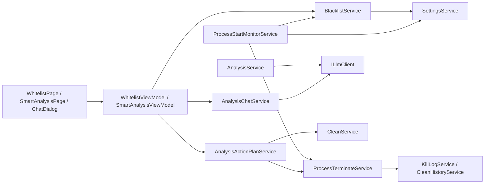

# 黑名单与对话式智能分析技术设计

## 1. 总体架构



## 2. 黑名单自动终止

### 2.1 数据与服务

- `AppSettings` 增加 `BlacklistProcesses` 和 `BlacklistAutoTerminateEnabled`。
- 新增 `BlacklistService`：负责标准化进程名、增删、快照读取和持久化。
- 新增 `ProcessStartMonitorService : IDisposable`：使用 Windows `ManagementEventWatcher` 监听 `Win32_ProcessStartTrace`，避免页面生命周期影响后台监控。
- `Locator.Init()` 创建黑名单服务和监控服务；`App.OnStartup` 启动监控，`OnExit` 释放监控。
- 监听服务只处理启动事件，不做 UI 绑定；结果通过事件切回 Dispatcher。

### 2.2 安全过滤

黑名单命中后先获取 PID 的实时快照，再按以下顺序过滤：

1. 应用自身 PID；
2. `WhitelistService.IsSystemCritical`；
3. `WhitelistService.IsNoKill`；
4. `ForegroundGuard.IsProtected`；
5. 进程已退出、PID 不存在或快照异常。

现有 `ExcludedProcesses` 只表示清理/分析排除，不作为黑名单的覆盖条件。自动终止使用 `ProcessTerminateService` 的独立自动路径，确保不会误用人工终止路径的白名单规则。

### 2.3 记录

- `KillRecord` 增加 `Source` 字段，兼容旧 JSON 时使用默认值 `Manual`。
- 自动终止结果写入 `KillLogService`，来源为 `Blacklist`。
- 失败和跳过原因通过 `BlacklistActionResult` 事件通知 UI；通知由现有托盘设置控制。
- 自动终止不复用人工确认弹窗，但开启总开关必须先经过一次风险确认。

## 3. 报告与对话

### 3.1 报告模型

- 新增 `AnalysisReport`：分析时间、模型、缓存标记、内存摘要、候选进程摘要、建议和文本摘要。
- `AnalysisService` 在生成 `AnalysisResult` 后由 `SmartAnalysisViewModel` 组装报告；若新分析失败，不清除旧报告。
- 页面级共享 `SmartAnalysisViewModel` 继续保留报告、对话和进行中状态，切换导航不丢失。

### 3.2 对话服务

- 新增 `AnalysisChatService`，复用 `ILlmClient.ChatAsync` 和当前 LLM 档案。
- 每轮对话发送：最近一次报告、必要的最新进程快照、用户自定义指令、有限长度的历史消息。
- LLM 输出使用严格 JSON：

```json
{
  "answer": "给用户看的回答",
  "plan": {
    "operation": "none|clean_working_sets|purge_standby|terminate_processes",
    "targets": ["process.exe"],
    "reason": "执行理由",
    "risk": "low|medium|high"
  }
}
```

- 解析失败时将原始内容作为普通回答展示，但不得生成可执行计划。
- 对话记录保存在当前 ViewModel 生命周期内，暂不写入磁盘，不保存 API Key。

### 3.3 执行计划

- 新增 `AnalysisActionPlanService`，负责校验计划、重新获取实时快照、应用白名单/系统关键/防误杀/前台保护规则，并调用现有 `CleanService` 或 `ProcessTerminateService`。
- `clean_working_sets` 对应现有 L1，`purge_standby` 对应现有 L2，`terminate_processes` 对应 L3。
- “清理线程”在界面中明确解释为进程工作集、待机列表或进程终止；不提供单个线程终止能力。
- 所有非 `none` 计划都必须经过用户确认；LLM 不拥有直接执行权限。
- L3 复用现有未保存工作提示；执行后写入 `CleanHistoryService`，对话执行来源新增 `CleanTrigger.Conversation`。

## 4. UI 设计

- `WhitelistPage` 增加独立黑名单卡片：名单、添加/删除、自动终止 Toggle、风险说明、最近一次结果。
- 开关使用现有 Fluent UI `ToggleSwitch`，默认关闭；打开前用确认对话框。
- `SmartAnalysisPage` 增加报告卡片和“继续提问”按钮。
- 新增 `AnalysisChatDialog`：消息气泡、输入框、发送/取消/清空对话按钮、请求中状态。
- 当回答包含执行计划时，显示计划卡片、目标列表、风险和“确认执行/取消”按钮。
- 复用现有主题资源和 `LocalizationService`，中英文文案同步增加。

## 5. 测试策略

- 黑名单标准化、持久化、系统关键/NoKill/自身进程拒绝添加单元测试。
- 使用可注入的进程启动事件源测试监听启停、命中、跳过和异常。
- 测试自动终止路径不受 `ExcludedProcesses` 错误影响，且不会突破安全过滤。
- 测试报告在分析失败和页面切换后保留。
- 测试对话 JSON 解析失败不产生执行计划。
- 测试每种执行计划都必须先确认，取消不调用清理/终止服务。
- 完成后运行现有全部构建和测试。
